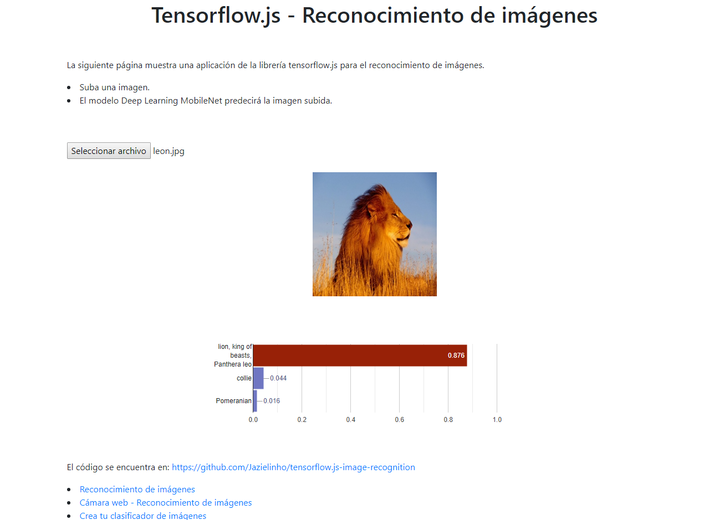

# Tensorflow.js reconocimiento de imágenes

Este es un proyecto para reconocer imágenes usando tensorflow en javascript.

URL de la aplicación: https://jazielinho.github.io/tensorflow.js-image-recognition/

El código se basa en el siguiente enlace:

* https://www.tensorflow.org/js/tutorials/transfer/image_classification

